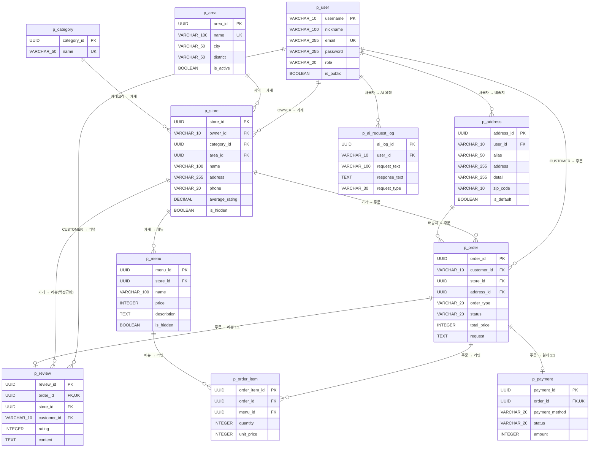

# 03. 데이터 명세 (ERD + 테이블 명세)

> 이전: [도메인 명세](02-domain-spec.md) · 다음: [API 명세](04-api-spec.md)

---

## 1. 공통 규칙

- 모든 테이블 접두사: `p_`
- PK: UUID (유저만 `username` VARCHAR 예외)
- **BaseEntity 상속 테이블** (자동 Audit 컬럼)
    - `created_at`, `created_by`, `updated_at`, `updated_by`, `deleted_at`, `deleted_by`
- **BaseEntity 미상속 테이블**: `p_order_item`, `p_ai_request_log`
    - 수정/삭제 이벤트가 없어 `created_at`, `created_by`만 직접 보유
- Soft Delete: `deleted_at IS NOT NULL`이면 논리 삭제
- 숨김: `is_hidden` (`p_store`, `p_menu`에만 존재, 삭제와 독립)

## 2. ERD

## 3. 테이블 명세

### 3.1 `p_user` (사용자) — PK 예외

| 필드         | 타입           | 제약               | 설명                            |
|------------|--------------|------------------|-------------------------------|
| username   | VARCHAR(10)  | PK               | `^[a-z0-9]{4,10}$`            |
| nickname   | VARCHAR(100) | NOT NULL         |                               |
| email      | VARCHAR(255) | UNIQUE, NOT NULL |                               |
| password   | VARCHAR(255) | NOT NULL         | BCrypt                        |
| role       | VARCHAR(20)  | NOT NULL         | CUSTOMER/OWNER/MANAGER/MASTER |
| is_public  | BOOLEAN      | DEFAULT true     |                               |
| + Audit 6개 |              |                  | BaseEntity                    |

### 3.2 `p_area` (운영 지역)

| 필드         | 타입           | 제약               | 설명     |
|------------|--------------|------------------|--------|
| area_id    | UUID         | PK               |        |
| name       | VARCHAR(100) | UNIQUE, NOT NULL | 예: 광화문 |
| city       | VARCHAR(50)  | NOT NULL         |        |
| district   | VARCHAR(50)  | NOT NULL         |        |
| is_active  | BOOLEAN      | DEFAULT true     |        |
| + Audit 6개 |              |                  |        |

### 3.3 `p_category` (카테고리)

| 필드          | 타입          | 제약               | 설명             |
|-------------|-------------|------------------|----------------|
| category_id | UUID        | PK               |                |
| name        | VARCHAR(50) | UNIQUE, NOT NULL | 한식/중식/분식/치킨/피자 |
| + Audit 6개  |             |                  |                |

### 3.4 `p_store` (가게)

| 필드             | 타입           | 제약                             | 설명    |
|----------------|--------------|--------------------------------|-------|
| store_id       | UUID         | PK                             |       |
| owner_id       | VARCHAR(10)  | FK → p_user.username, NOT NULL |       |
| category_id    | UUID         | FK → p_category, NOT NULL      |       |
| area_id        | UUID         | FK → p_area, NOT NULL          |       |
| name           | VARCHAR(100) | NOT NULL                       |       |
| address        | VARCHAR(255) | NOT NULL                       |       |
| phone          | VARCHAR(20)  |                                |       |
| average_rating | DECIMAL(2,1) | DEFAULT 0.0                    | 캐싱 컬럼 |
| is_hidden      | BOOLEAN      | DEFAULT false                  |       |
| + Audit 6개     |              |                                |       |

### 3.5 `p_menu` (메뉴)

| 필드          | 타입           | 제약                     | 설명          |
|-------------|--------------|------------------------|-------------|
| menu_id     | UUID         | PK                     |             |
| store_id    | UUID         | FK → p_store, NOT NULL |             |
| name        | VARCHAR(100) | NOT NULL               |             |
| price       | INTEGER      | NOT NULL, CHECK > 0    | 원           |
| description | TEXT         |                        | AI 자동 생성 가능 |
| is_hidden   | BOOLEAN      | DEFAULT false          |             |
| + Audit 6개  |              |                        |             |

### 3.6 `p_order` (주문)

| 필드          | 타입          | 제약                             | 설명   |
|-------------|-------------|--------------------------------|------|
| order_id    | UUID        | PK                             |      |
| customer_id | VARCHAR(10) | FK → p_user.username, NOT NULL |      |
| store_id    | UUID        | FK → p_store, NOT NULL         |      |
| address_id  | UUID        | FK → p_address                 |      |
| order_type  | VARCHAR(20) | NOT NULL, DEFAULT 'ONLINE'     |      |
| status      | VARCHAR(20) | NOT NULL, DEFAULT 'PENDING'    |      |
| total_price | INTEGER     | NOT NULL                       |      |
| request     | TEXT        |                                | 요청사항 |
| + Audit 6개  |             |                                |      |

### 3.7 `p_order_item` (주문 라인) — Audit 미상속

| 필드            | 타입           | 제약                     | 설명           |
|---------------|--------------|------------------------|--------------|
| order_item_id | UUID         | PK                     |              |
| order_id      | UUID         | FK → p_order, NOT NULL |              |
| menu_id       | UUID         | FK → p_menu, NOT NULL  |              |
| quantity      | INTEGER      | NOT NULL, CHECK > 0    |              |
| unit_price    | INTEGER      | NOT NULL               | 주문 당시 단가 스냅샷 |
| created_at    | TIMESTAMP    | NOT NULL               |              |
| created_by    | VARCHAR(100) |                        |              |

### 3.8 `p_review` (리뷰)

| 필드          | 타입          | 제약                             | 설명      |
|-------------|-------------|--------------------------------|---------|
| review_id   | UUID        | PK                             |         |
| order_id    | UUID        | FK → p_order, UNIQUE, NOT NULL | 1주문 1리뷰 |
| store_id    | UUID        | FK → p_store, NOT NULL         | 역정규화    |
| customer_id | VARCHAR(10) | FK → p_user.username, NOT NULL |         |
| rating      | INTEGER     | NOT NULL, CHECK 1~5            |         |
| content     | TEXT        |                                |         |
| + Audit 6개  |             |                                |         |

### 3.9 `p_payment` (결제)

| 필드             | 타입          | 제약                             | 설명                          |
|----------------|-------------|--------------------------------|-----------------------------|
| payment_id     | UUID        | PK                             |                             |
| order_id       | UUID        | FK → p_order, UNIQUE, NOT NULL | 1주문 1결제                     |
| payment_method | VARCHAR(20) | NOT NULL, DEFAULT 'CARD'       | CARD만 허용                    |
| status         | VARCHAR(20) | NOT NULL, DEFAULT 'PENDING'    | PENDING/COMPLETED/CANCELLED |
| amount         | INTEGER     | NOT NULL                       |                             |
| + Audit 6개     |             |                                |                             |

### 3.10 `p_address` (배송지)

| 필드         | 타입           | 제약                             | 설명        |
|------------|--------------|--------------------------------|-----------|
| address_id | UUID         | PK                             |           |
| user_id    | VARCHAR(10)  | FK → p_user.username, NOT NULL |           |
| alias      | VARCHAR(50)  |                                | 집/회사      |
| address    | VARCHAR(255) | NOT NULL                       | 필수        |
| detail     | VARCHAR(255) |                                |           |
| zip_code   | VARCHAR(10)  |                                |           |
| is_default | BOOLEAN      | DEFAULT false                  | 유저당 최대 1개 |
| + Audit 6개 |              |                                |           |

### 3.11 `p_ai_request_log` (AI 요청 로그) — Audit 미상속

| 필드            | 타입           | 제약                             | 설명                  |
|---------------|--------------|--------------------------------|---------------------|
| ai_log_id     | UUID         | PK                             |                     |
| user_id       | VARCHAR(10)  | FK → p_user.username, NOT NULL |                     |
| request_text  | VARCHAR(100) | NOT NULL                       | 최대 100자             |
| response_text | TEXT         |                                | Gemini 응답           |
| request_type  | VARCHAR(30)  | NOT NULL                       | PRODUCT_DESCRIPTION |
| created_at    | TIMESTAMP    | NOT NULL                       |                     |
| created_by    | VARCHAR(100) |                                |                     |

## 4. 인덱스 가이드 (권장)

| 테이블              | 인덱스                                               | 목적           |
|------------------|---------------------------------------------------|--------------|
| p_store          | `(category_id)`, `(area_id)`, `(name)`            | 복합 검색        |
| p_menu           | `(store_id)`                                      | 가게별 메뉴 조회    |
| p_order          | `(customer_id, created_at)`, `(store_id, status)` | 사용자/가게 주문 목록 |
| p_order_item     | `(order_id)`                                      | 라인 조회        |
| p_review         | `(store_id, created_at)`                          | 가게 리뷰 리스트    |
| p_payment        | `(order_id)` UNIQUE                               | 결제 1:1       |
| p_address        | `(user_id, is_default)`                           | 기본 배송지 조회    |
| p_ai_request_log | `(user_id, created_at)`                           | 사용자 로그 조회    |
