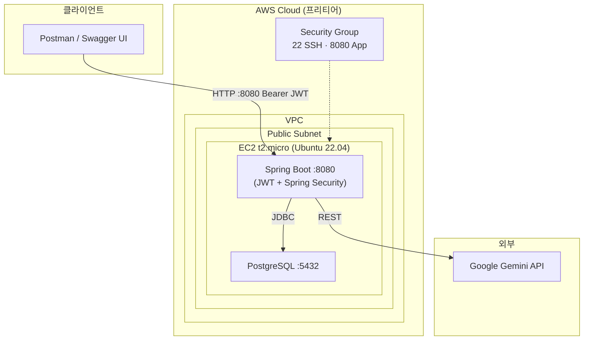

# 06. 인프라 명세

> 이전: [서비스 로직 명세](05-service-spec.md) · 다음: [코드 레벨 설계](07-code-design.md)

---

## 1. 배포 아키텍처



- 단일 EC2 인스턴스에 Spring Boot + PostgreSQL을 함께 배치 (MVP)
- AI 호출은 외부(Google Gemini)로 HTTPS 아웃바운드

## 2. 기술 스택

| 구분          | 기술                             | 비고                                  |
|-------------|--------------------------------|-------------------------------------|
| Language    | Java 17 (LTS)                  |                                     |
| Framework   | Spring Boot 3.x                | Web, Data JPA, Validation, Security |
| Security    | Spring Security + `jjwt`       | 매 요청 DB 권한 재검증                      |
| ORM         | JPA / Hibernate                |                                     |
| 복합 검색       | QueryDSL JPA                   | [도전]                                |
| DB          | PostgreSQL 15+                 | EC2에 직접 설치                          |
| Build       | Gradle 8.x                     |                                     |
| API 문서      | springdoc-openapi (Swagger UI) | 또는 Spring REST Docs                 |
| HTTP Client | `RestTemplate` 또는 `WebClient`  | Gemini 호출, 팀 선택                     |
| AI          | Gemini 1.5 Flash               | REST 호출                             |
| 로깅          | Logback                        | [도전]                                |
| Server      | AWS EC2 t2.micro               | Ubuntu 22.04                        |

## 3. 환경 프로필

| Profile | DB               | 용도          |
|---------|------------------|-------------|
| `local` | H2 In-Memory     | 개발자 개인 환경   |
| `test`  | H2 In-Memory     | JUnit 단위/통합 |
| `prod`  | PostgreSQL (EC2) | 운영 배포       |

- 프로필 전환: `-Dspring.profiles.active=prod`
- 환경별 `application-{profile}.yml` 분리

## 4. 배포 방식

### 옵션 A — JAR 직접 실행 (권장: 학습 목적)

```
1. 로컬: ./gradlew clean build
2. scp build/libs/app.jar ubuntu@{EC2}:/home/ubuntu/
3. EC2: nohup java -jar -Dspring.profiles.active=prod app.jar > app.log 2>&1 &
```

### 옵션 B — Docker

```
1. Dockerfile 작성
2. docker build -t delivery-app .
3. 레지스트리 푸시 or 이미지 직접 전송
4. EC2: docker run -d -p 8080:8080 --env-file .env delivery-app
```

## 5. 네트워크 / 보안

- **Security Group 인바운드**: 22(SSH, 내 IP만), 8080(App, 0.0.0.0/0)
- **DB 포트 5432**: 외부 노출 X (로컬호스트 통신만)
- **민감 정보**: 환경 변수
    - `GEMINI_API_KEY`
    - `DB_PASSWORD`
    - `JWT_SECRET`
- **비밀번호**: BCrypt 해시 저장, 로그 출력 금지
- **JWT**: `Authorization: Bearer {token}`, HS256
- **권한 재검증**: JWT payload role ↔ DB role. 권한 변경 / 유저 삭제 시 기존 토큰 사용 불가
    - DB 부하 완화: 향후 Redis 캐시 도입 고려

## 6. 모니터링 / 로깅

- Logback로 `app.log` 파일 롤링 ([도전])
- 추후 고려: CloudWatch Agent 연동, Spring Actuator `/health`

## 7. 백업 / 복구 (MVP)

- 수동 `pg_dump` 주기 실행
- 운영 확장 시 RDS 전환 + 자동 스냅샷

## 8. 확장 로드맵

| 단계  | 변경                             |
|-----|--------------------------------|
| MVP | EC2 단일 노드 + PostgreSQL         |
| 확장1 | RDS 분리, S3 로그 적재               |
| 확장2 | Redis 캐시(권한/인기 쿼리)             |
| 확장3 | ALB + Auto Scaling, CloudFront |
