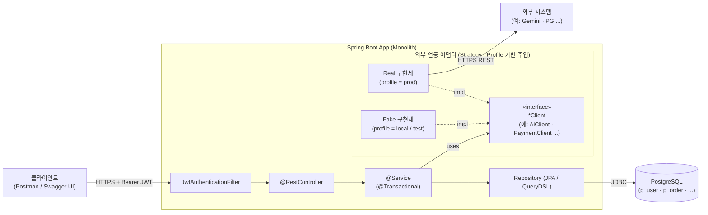
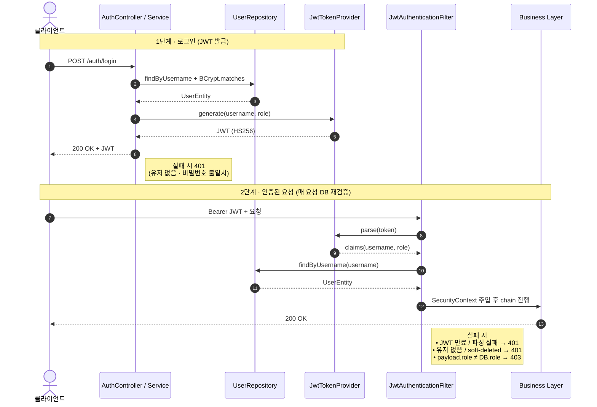
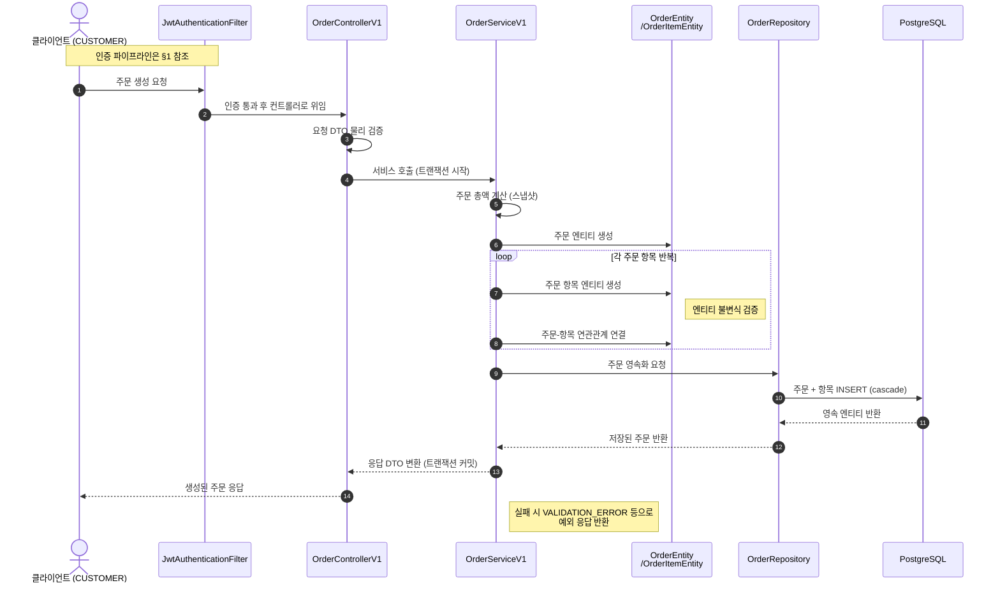

# 08. 애플리케이션 흐름

> 이전: [코드 레벨 설계](07-code-design.md)

애플리케이션 런타임 관점의 호출 흐름·시퀀스 모음.

---

## 0. 런타임 컴포넌트 도식

요청이 논리 컴포넌트를 따라 어떻게 흐르는지의 전반적인 그림. 주요 유스케이스별 시퀀스는 다음 섹션에서 상세히 다룬다.

- 검증 레이어: Controller는 `@NotBlank`/`@Size` 등 **물리 Validation**, 도메인 객체/Service는 **논리 규칙**(정규식·범위·상태 전이)
- `JwtAuthenticationFilter`는 매 요청마다 DB에서 현재 `role` / `deleted_at`을 재조회해 토큰 payload와 대조
- **외부 연동 어댑터**: AI · PG 등 외부 시스템 호출은 `*Client` 인터페이스 + Real/Fake 구현체 2종 패턴 사용 고려.
- 외부 호출 로그(예: `AiRequestLog`)는 Service 레이어에서 성공/실패 모두

## 1. 인증 파이프라인

로그인으로 JWT를 발급받고, 이후 요청마다 Filter가 **DB에서 role/삭제 여부를 재검증**하는 두 단계 흐름.

**설계 포인트**

- **매 요청 DB 재검증**: JWT payload만 신뢰하지 않고 `UserRepository.findByUsername`으로 현재 `role`·`deleted_at`을 확인. 권한 변경/탈퇴 시 기존 토큰이
  **즉시 무력화**되는 효과 (별도 블랙리스트 불필요).
    - 트레이드오프: 모든 요청이 DB 1회 조회를 추가로 발생시킴. 부하 커지면 Redis 캐시 고려
- **401 vs 403 구분**: "본인 확인 실패" = 401 (토큰 파싱 실패, 유저 없음, 삭제됨), "본인은 맞지만 권한 부족" = 403 (payload.role ≠ DB.role).

## 2. 주문 생성

CUSTOMER가 주문을 생성하는 흐름. 컨트롤러 진입 이후 서비스는 트랜잭션 경계·조립만 담당하고, 상태 전이/불변식은 `OrderEntity`가 스스로 검증한다.

**설계 포인트**

- **주문 시점 스냅샷**: `totalPrice`는 서비스가 클라이언트 입력 `quantity × unitPrice`로 계산해 저장. 이후 메뉴 가격이 바뀌거나 메뉴가 삭제되어도 과거 주문 금액은 불변.
- **물리 검증(@Valid) vs 논리 불변식**: DTO 레이어에서 `@NotNull`/`@Min` 같은 물리 검증을 먼저 걷어내고, `OrderItemEntity` 생성자가 `quantity > 0` / `unitPrice ≥ 0` 논리 불변식을 한 번 더 방어한다.
- **Cascade ALL + orphanRemoval**: `OrderItemEntity`는 별도 save 호출 없이 `addItem()` → `orderRepository.save(order)` 한 번으로 함께 영속화된다.
- **도메인 로직 위임**: 서비스는 트랜잭션 경계·조립만 담당하고, 상태 전이/불변식 검증은 `OrderEntity`가 스스로 수행한다 (DDD 관점).
- **Soft Delete**: `@SQLRestriction("deleted_at IS NULL")` 로 조회 시 자동 제외.

## 3. 결제 (Fake / 실 PG)

> **TBD**

## 4. 메뉴 생성 + AI 설명

> **TBD**